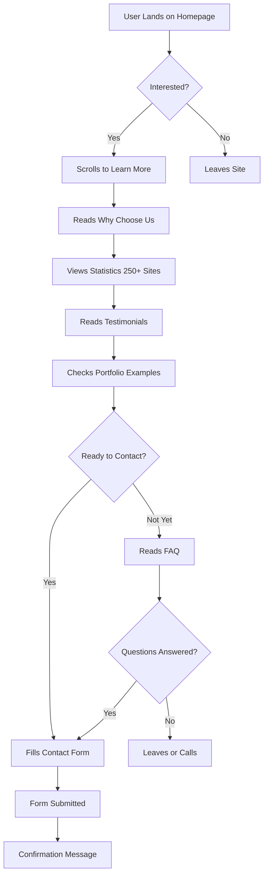
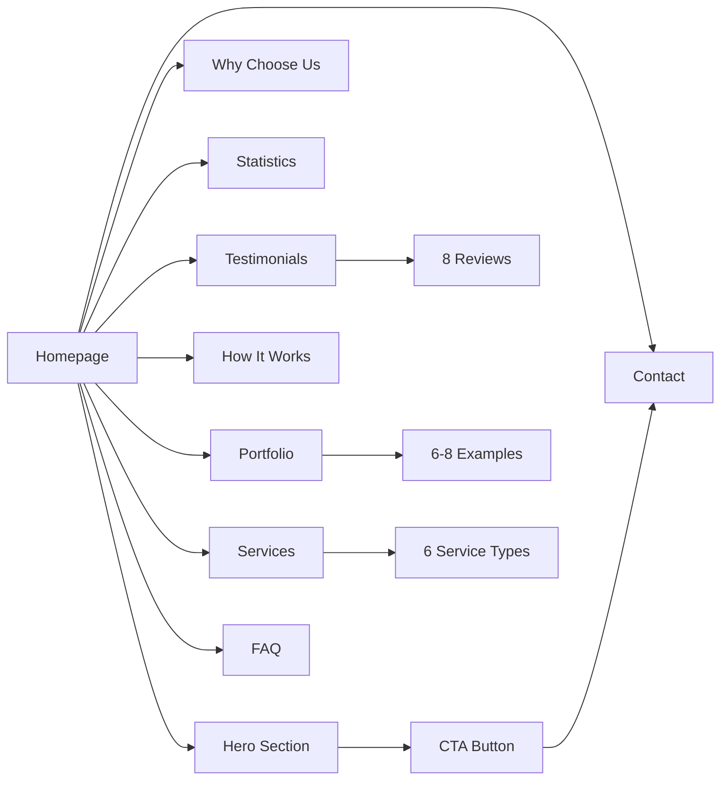

# The Scottish Free Website Guys - Project Plan

## Overview
Create a landing page for "The Scottish Free Website Guys" based on "The Free Website Guys" design, adapted for the Scottish market with adjusted metrics (250+ websites) and Scottish-themed branding.

## Design Analysis from Reference Page

Based on the screenshot, the reference page includes these key sections:

### 1. **Hero Section**
- Dark purple/navy background with gradient
- Bold headline with value proposition
- Clear call-to-action button
- Professional imagery/graphics
- Trust indicators

### 2. **Services/Features Section**
- Clean white background
- Grid layout showcasing different website types
- Icons or images for each service
- Brief descriptions

### 3. **Statistics/Social Proof Section**
- Dark background (purple theme)
- Key metrics displayed prominently
- Number of websites built, clients served, etc.

### 4. **Pricing/Packages Section**
- Comparison table or cards
- Different tiers/options
- Clear pricing structure
- Feature lists

### 5. **Portfolio/Examples Section**
- Website mockups/screenshots
- Before/after or example showcases
- Visual proof of work quality

### 6. **Testimonials Section**
- Customer reviews
- Star ratings
- Client names and businesses
- Purple/branded background

### 7. **FAQ or Additional Info**
- Common questions answered
- Additional value propositions

### 8. **Contact/CTA Section**
- Contact form or booking system
- Final call-to-action
- Contact information

## Adaptations for Scottish Market

### Branding Changes
- **Company Name**: "The Scottish Free Website Guys"
- **Color Scheme**: Incorporate Scottish elements
  - Keep purple/navy base (professional)
  - Add subtle Scottish blue accents
  - Consider tartan pattern elements (subtle, not overwhelming)
  - White and gold accents for premium feel

### Content Adjustments
- **Statistics**: Change from 1000+ to **250+ websites built**
- **Target Audience**: Scottish small businesses, local shops, tradespeople
- **Location References**: Mention Scottish cities (Edinburgh, Glasgow, Aberdeen, Dundee, Inverness)
- **Language**: Use Scottish-friendly terminology while keeping professional

### Fake Reviews to Create
Generate 6-8 testimonials from fictional Scottish businesses:

1. **Highland Coffee Roasters** (Edinburgh)
   - 5 stars
   - "Brilliant service! Got our coffee shop online in no time. The team understood exactly what we needed."
   - Owner: Fiona MacLeod

2. **Glasgow Plumbing Services** (Glasgow)
   - 5 stars
   - "As a tradesman, I had no clue about websites. These guys made it dead simple and it's brought in loads of new customers."
   - Owner: James Campbell

3. **Dundee Dental Practice** (Dundee)
   - 5 stars
   - "Professional, efficient, and the website looks fantastic. Our patient bookings have increased significantly."
   - Owner: Dr. Sarah Morrison

4. **Aberdeen Auto Repairs** (Aberdeen)
   - 5 stars
   - "Top-notch work. The website has helped us compete with the bigger garages. Highly recommend!"
   - Owner: Robert Fraser

5. **Inverness Bakery** (Inverness)
   - 5 stars
   - "We were hesitant about getting a website, but the Scottish Free Website Guys made it so easy. Our online orders have been brilliant!"
   - Owner: Margaret Stewart

6. **Edinburgh Fitness Studio** (Edinburgh)
   - 5 stars
   - "The website is exactly what we needed. Clean, professional, and our class bookings have never been easier."
   - Owner: Andrew Douglas

7. **Stirling Landscaping** (Stirling)
   - 5 stars
   - "Fantastic service from start to finish. The website showcases our work perfectly and we've had great feedback from clients."
   - Owner: Duncan MacKenzie

8. **Perth Pet Grooming** (Perth)
   - 5 stars
   - "Couldn't be happier! The website is lovely and easy for our customers to use. Worth every penny... well, it was free!"
   - Owner: Emma Robertson

## Technical Implementation Structure

### File Structure
```
scottish-free-website-guys/
├── index.html
├── css/
│   ├── style.css
│   ├── responsive.css
│   └── animations.css
├── js/
│   ├── main.js
│   └── animations.js
├── images/
│   ├── hero-bg.jpg
│   ├── logo.png
│   ├── portfolio/
│   ├── icons/
│   └── testimonials/
└── assets/
    └── fonts/
```

### Key Sections to Build

#### 1. Hero Section
```
- Headline: "Free Professional Websites for Scottish Businesses"
- Subheadline: "Join 250+ Scottish businesses already online"
- CTA Button: "Get Your Free Website"
- Background: Dark purple gradient with subtle Scottish thistle pattern
- Trust badges: "No Hidden Costs" | "Professional Design" | "Local Support"
```

#### 2. Why Choose Us Section
```
- "100% Free" - No upfront costs, no hidden fees
- "Professional Design" - Beautiful, modern websites
- "Scottish Based" - Local support for Scottish businesses
- "Quick Setup" - Get online in days, not months
- "Mobile Friendly" - Looks great on all devices
- "SEO Optimized" - Get found on Google
```

#### 3. Statistics Section
```
- 250+ Websites Built
- 98% Client Satisfaction
- 5-Star Average Rating
- Serving All of Scotland
```

#### 4. Services/Website Types
```
- Restaurants & Cafes
- Tradespeople (Plumbers, Electricians, etc.)
- Retail Shops
- Professional Services (Dentists, Lawyers, etc.)
- Fitness & Wellness
- Beauty & Salons
```

#### 5. How It Works
```
Step 1: Book a Free Consultation
Step 2: We Design Your Website
Step 3: Review & Approve
Step 4: Go Live!
```

#### 6. Portfolio Examples
```
- Show 6-8 example websites (can be mockups)
- Different industries
- Before/after comparisons optional
- Hover effects showing website names
```

#### 7. Testimonials
```
- Carousel or grid of 6-8 reviews (listed above)
- Include star ratings
- Business name and location
- Owner name
- Photo placeholders (can use initials or icons)
```

#### 8. FAQ Section
```
- "Is it really free?" - Yes! explanation
- "What's the catch?" - Revenue model explanation
- "How long does it take?" - Timeline
- "Do I own the website?" - Ownership details
- "Can I update it myself?" - CMS info
- "What about hosting?" - Hosting details
```

#### 9. Contact Section
```
- Contact form (Name, Email, Phone, Business Type, Message)
- Phone number: +44 (0)131 XXX XXXX
- Email: hello@scottishfreewebsiteguys.co.uk
- Serving: All of Scotland
- CTA: "Ready to Get Started? Let's Talk!"
```

## Design Specifications

### Color Palette
- **Primary Purple**: #4A148C (deep purple)
- **Secondary Purple**: #7B1FA2 (medium purple)
- **Accent Blue**: #1976D2 (Scottish blue)
- **Gold Accent**: #FFD700 (premium touch)
- **White**: #FFFFFF
- **Light Gray**: #F5F5F5 (backgrounds)
- **Dark Text**: #212121
- **Light Text**: #757575

### Typography
- **Headings**: Bold, modern sans-serif (e.g., Montserrat, Poppins)
- **Body**: Clean, readable sans-serif (e.g., Open Sans, Roboto)
- **Sizes**:
  - H1: 48-56px
  - H2: 36-42px
  - H3: 28-32px
  - Body: 16-18px

### Visual Elements
- **Subtle Scottish touches**:
  - Thistle icon in logo
  - Subtle tartan pattern in backgrounds (very light)
  - Scottish flag colors as accents
  - Map of Scotland in statistics section
  
- **Modern, professional feel**:
  - Clean lines
  - Ample white space
  - Professional photography/illustrations
  - Smooth animations and transitions

### Animations & Interactions
- Smooth scroll to sections
- Fade-in animations on scroll
- Hover effects on buttons and cards
- Testimonial carousel/slider
- Counter animations for statistics
- Form validation feedback

## Responsive Design Breakpoints
- **Desktop**: 1200px+
- **Laptop**: 992px - 1199px
- **Tablet**: 768px - 991px
- **Mobile**: < 768px

### Mobile Optimizations
- Hamburger menu for navigation
- Stacked sections instead of side-by-side
- Touch-friendly buttons (min 44px)
- Optimized images for mobile
- Simplified animations

## Content Strategy

### SEO Keywords
- Free websites Scotland
- Scottish web design
- Free website for small business Scotland
- Edinburgh web design
- Glasgow website builder
- Scottish business websites

### Meta Information
```html
<title>The Scottish Free Website Guys | Free Professional Websites for Scottish Businesses</title>
<meta name="description" content="Get a free professional website for your Scottish business. Join 250+ businesses across Scotland already online. No hidden costs, professional design, local support.">
```

## Development Phases

### Phase 1: Structure & Layout
- Set up HTML structure
- Create CSS framework
- Implement responsive grid system
- Set up navigation

### Phase 2: Hero & Core Sections
- Build hero section with CTA
- Create "Why Choose Us" section
- Implement statistics section
- Add services/features grid

### Phase 3: Social Proof & Portfolio
- Build testimonials section with reviews
- Create portfolio showcase
- Add client logos (if applicable)

### Phase 4: Forms & Interaction
- Implement contact form
- Add form validation
- Create FAQ accordion
- Set up smooth scrolling

### Phase 5: Polish & Optimization
- Add animations and transitions
- Optimize images
- Test responsive design
- Cross-browser testing
- Performance optimization

## Success Metrics

Once launched, track:
- Form submissions
- Time on page
- Scroll depth
- Mobile vs desktop traffic
- Geographic distribution (Scottish cities)
- Conversion rate (visitors to leads)

## Next Steps

1. **Review this plan** - Confirm all sections and content align with vision
2. **Gather assets** - Collect any specific images, logos, or content
3. **Begin development** - Start with Phase 1 (Structure & Layout)
4. **Iterative review** - Review each section as it's built
5. **Testing** - Comprehensive testing before launch
6. **Launch** - Deploy to hosting platform

---

## Notes

- Keep the professional, trustworthy feel of the original
- Scottish branding should be present but not overwhelming
- Focus on clarity and conversion (getting contact form submissions)
- Ensure fast loading times (critical for user experience)
- Make it easy to update testimonials and statistics as business grows
- Consider adding a blog section for SEO in future phases

## Mermaid Diagram: User Journey



## Mermaid Diagram: Site Structure



---

**This plan provides a comprehensive roadmap for building "The Scottish Free Website Guys" website, maintaining the professional quality and conversion-focused design of the original while adapting it perfectly for the Scottish market.**
